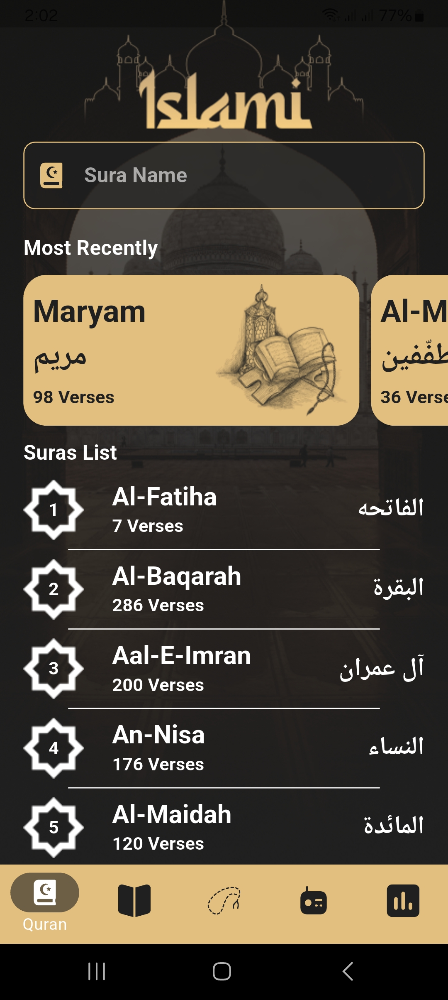
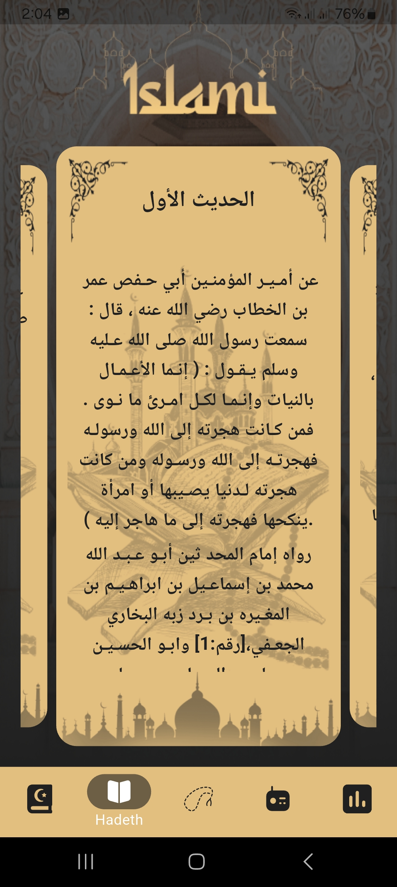
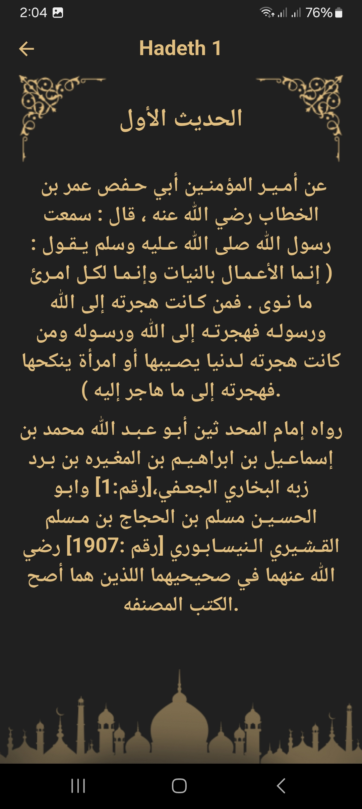
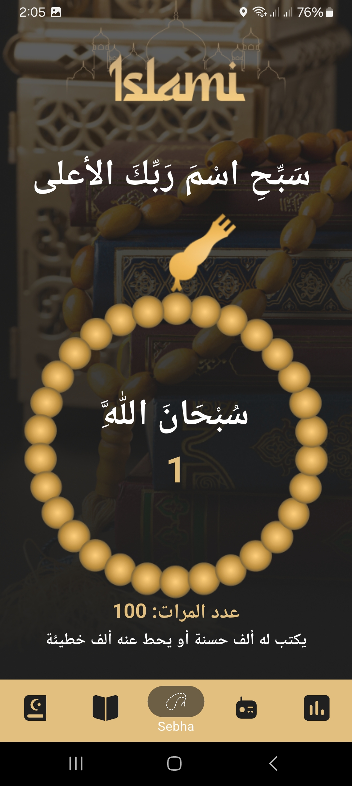
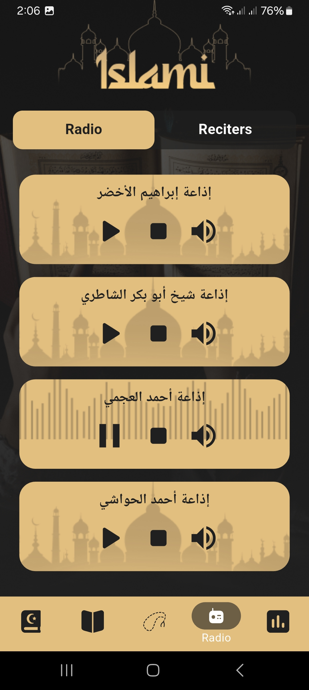
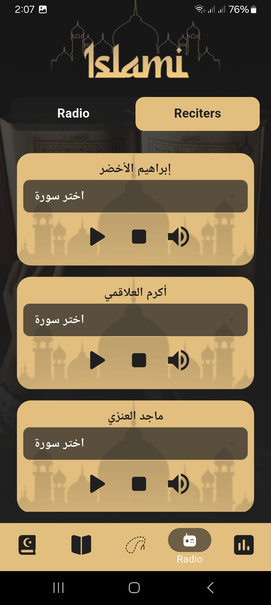
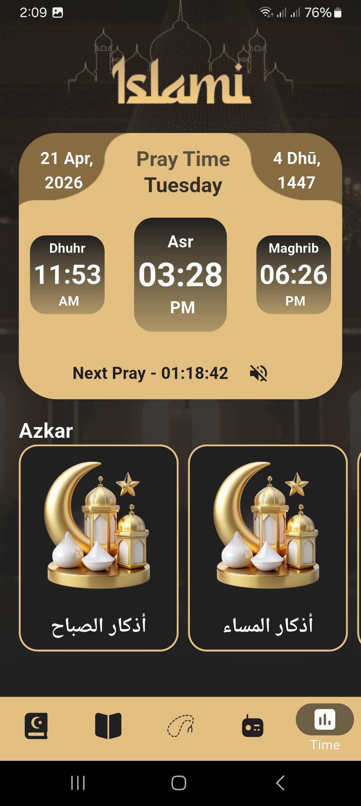
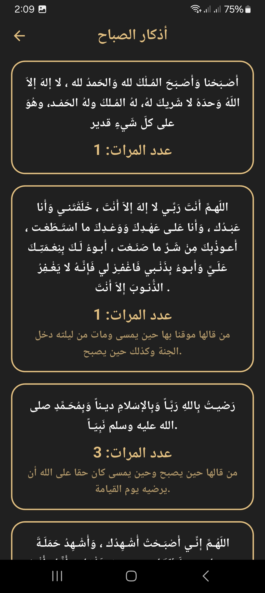

# 📱 Islami App

A modern Islamic Flutter application that provides useful daily tools for Muslims, including Quran reading, audio playback, and a clean Islamic UI experience.

---

## ✨ Features

* 📖 Quran content with organized text display
* 🎧 Audio playback using audioplayers
* 🌙 Clean and simple Islamic UI
* 📊 Local storage using SharedPreferences
* 🎠 Interactive UI with carousel sliders
* 🌍 API integration using HTTP
* 🔤 Auto-resizing text for better readability
* 📥 Dropdown search for easy navigation
* 🧭 Introduction/onboarding screens

---

## 📸 Screenshots

<p align="center">
  
  
  
  
  
  
  
  
</p>

👉 More Screenshots:
https://drive.google.com/drive/u/0/folders/18XIlSEpQZghxBxQgvwiQas9_mFjo-FdE

---

## 🎥 Demo Video

👉 Watch the app demo:
https://drive.google.com/file/d/1fSzmweXMGWSAf2Wm0FzqLL8yKnsXIL5U/view?usp=drive_open

---

## 📦 Download APK

👉 Get latest APK:
https://drive.google.com/file/d/1D9-EQB1fBijO0UPt3BgqSFUMUHiV23AH/view


---

## 🛠️ Tech Stack

* Flutter
* Dart
* Provider (State Management)
* SharedPreferences (Local Storage)
* HTTP (API calls)
* Audioplayers (Audio handling)
* UI Enhancements:
  * Flutter SVG
  * Carousel Slider
  * Auto Size Text

---

## 📁 Project Structure

```
lib/
├── models/
├── providers/
├── screens/
├── widgets/
assets/
├── images/
├── icons/
├── texts/
```

---

## ⚙️ Getting Started

1. Clone the repository:

```bash
git clone https://github.com/your-username/islami-app.git
```

2. Navigate to project folder:

```bash
cd islami-app
```

3. Install dependencies:

```bash
flutter pub get
```

4. Run the app:

```bash
flutter run
```

---

## 🎨 Assets

* Images: `assets/images/`
* Icons: `assets/icons/`
* Text files: `assets/texts/`

---

## 📱 App Icon & Splash

* Launcher icon configured via `flutter_launcher_icons`
* Splash screen via `flutter_native_splash`

---

## 👨‍💻 Author

Ahmed Abd El-Moniem

---

## 📄 License

This project is for educational purposes.
